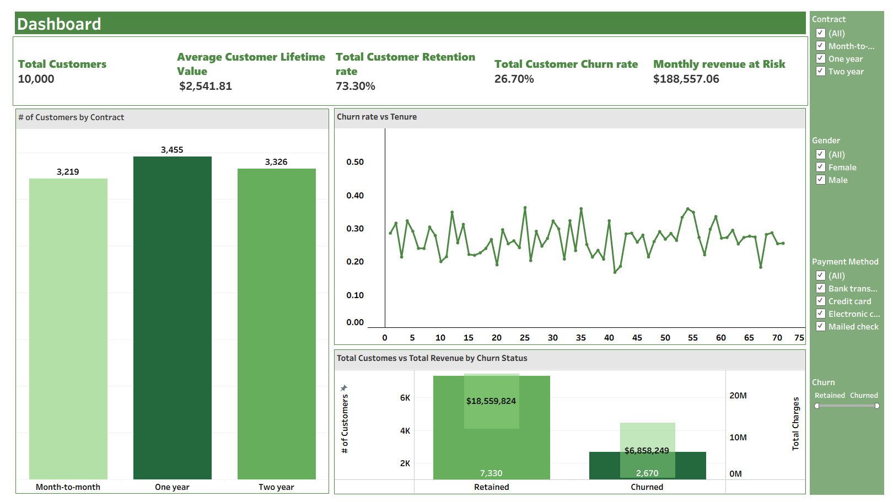
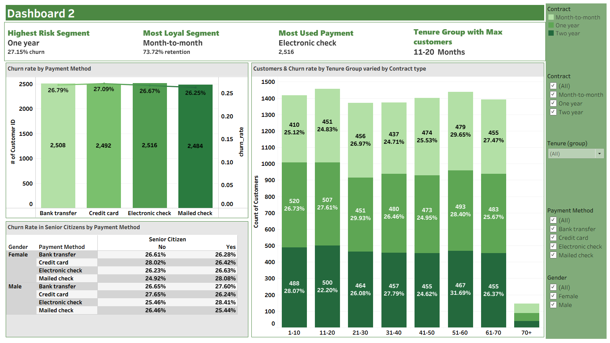

# Telecom Customer Churn Analysis
### Built with Tableau | Data Source: Kaggle

---

## About the Project

Built entirely in Tableau, this project analyzes customer churn behavior across a telecom company's base of 10,000 customers. Leveraging a Kaggle dataset, the full analytical pipeline was engineered from scratch — from data preparation and field engineering to building interactive dashboards that respond in real time to user-applied filters.

The result is a two-dashboard business intelligence solution that lets stakeholders explore churn patterns by contract type, payment method, tenure, gender, and senior citizen status without ever touching a spreadsheet. Every visual was designed with a specific business question in mind, making the dashboards not just informative but immediately actionable.

**Tools and Technologies Used**

| Tool | Purpose |
|---|---|
| Tableau Desktop | Dashboard development and visualization |
| Microsoft Excel | Data cleaning and preparation |
| Kaggle | Data source |

---

## Problem Statement

Telecom companies lose significant revenue every month to customer churn, yet the patterns driving that churn are rarely visible in raw data. The business lacked a unified view to answer critical questions around at-risk segments, payment behavior, tenure trends, and contract-level retention — leaving customer success, marketing, and product teams without a reliable data foundation.

This project was built to answer the following core business questions:

- What is the overall churn rate and how much monthly revenue is at risk?
- Which contract types and payment methods are most associated with customer churn?
- How does customer tenure influence churn behavior over time?
- Which customer segments — by gender, senior citizen status, and payment method — are most vulnerable to churning?
- Where do opportunities exist to improve retention strategy and reduce revenue leakage?

---

## Dataset Overview

| Column | Description |
|---|---|
| CustomerID | Unique identifier assigned to each customer |
| Gender | Customer's gender classification (Male/Female) |
| SeniorCitizen | Binary indicator identifying whether the customer is aged 65 or above |
| Tenure | Number of months the customer has stayed with the company |
| MonthlyCharges | Current monthly subscription fee charged to the customer |
| Contract | Type of customer agreement (Month-to-month, One year, Two year) |
| PaymentMethod | Billing payment method used by the customer |
| TotalCharges | Cumulative amount charged to the customer over their entire tenure |
| Churn | Target variable indicating if the customer left (1) or stayed (0) |

**Dataset Size:** 10,000 records

---

## Dashboard Snapshots

### Dashboard 1: Churn Overview

### Dashboard 2: Segment Deep Dive

---

## Output Interpretation

The project delivers insight across two focused dashboards, covering everything from high-level KPIs to granular segment-level churn behavior.

**Overall Performance**
- 10,000 total customers analyzed across all contract types and payment methods
- Overall churn rate stands at 26.70%, with 2,670 customers having left the company
- Retention rate holds at 73.30%, with 7,330 customers remaining active
- Monthly revenue at risk totals $188,557.06, highlighting the direct financial impact of churn
- Average Customer Lifetime Value is $2,541.81 per customer

**Contract and Revenue Insights**
- One year contract holders represent the largest customer segment at 3,455 customers, followed by Two year at 3,326 and Month-to-month at 3,219
- Retained customers generated $18,559,824 in total charges compared to $6,858,249 from churned customers, underscoring the long-term revenue value of retention
- Churn rate fluctuates across tenure months but remains broadly consistent between 20% and 40%, suggesting churn is not heavily concentrated in early or late tenure stages

**Segment Analysis**
- One year contract holders represent the highest risk segment at 27.15% churn rate
- Month-to-month contract holders are the most loyal segment at 73.72% retention rate
- Electronic check is the most used payment method with 2,516 customers, while churn rates remain relatively consistent across all four payment methods — ranging from 26.25% to 27.09%
- The 11-20 months tenure group holds the largest share of customers, making it a critical retention window
- Senior citizen churn rates are marginally higher across most gender and payment method combinations, with Male Electronic check senior citizens showing the highest churn at 28.41%

---

## Results

The dashboards transformed a flat dataset into a fully navigable churn intelligence tool. Decision makers can now isolate churn behavior by any combination of contract type, payment method, tenure group, gender, and senior citizen status in seconds, without relying on manual reporting or static summaries.

The project demonstrates a complete end-to-end analytical workflow — data preparation, KPI engineering, and visual storytelling — delivering a solution that is not just insightful but built to support informed, real-time decisions across customer success, marketing, and retention strategy teams.

**Key outcomes delivered:**
- Centralized 10,000 customer records into two interactive dashboards with dynamic filtering
- Quantified monthly revenue at risk at $188,557.06, giving leadership a direct financial lens on churn
- Identified One year contracts as the highest risk segment at 27.15% churn, challenging the assumption that longer contracts always mean more loyalty
- Surfaced tenure, payment method, and demographic-level patterns that were previously invisible in raw data
- Designed a two-dashboard layout that guides stakeholders from high-level churn overview to granular segment-level insight

---

## Connect with Me

**Sai Deepak Poondla**
Data Analyst | Tableau | Power BI | SQL | Python

[LinkedIn](http://www.linkedin.com/in/sai-deepak-poondla-7143ba21a) | [Portfolio](https://saideepakp.github.io)